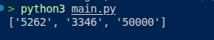

# PIN Extractor 🔐

A simple Python project that extracts hidden secret PIN codes from poems using word positions and word lengths.

This project demonstrates:

* String manipulation
* Loops
* Lists
* Conditional statements
* Functions
* Index-based logic
* Basic algorithm design in Python

---

## 📖 Project Description

The `pin_extractor()` function scans through lines of poems and generates a secret numeric code.

For each line in a poem:

1. The algorithm selects the word whose position matches the line number.
2. It counts the number of characters in that word.
3. The length becomes a digit in the secret PIN code.
4. If the required word does not exist, `0` is added instead.

The final result is a hidden numeric PIN generated from the poem structure.

---

## 🧠 How the Algorithm Works

For every poem:

* Split the poem into lines using `\n`
* Loop through each line with its index
* Split each line into words
* Select the word at the matching index position
* Count the length of that word
* Append the number to the secret code

Example:

Line index `0` → first word
Line index `1` → second word
Line index `2` → third word

And so on.

---

## 📂 Code Example

```python
def pin_extractor(poems):
    secret_codes = []    
    
    for poem in poems:
        secret_code = ""
        lines = poem.split('\n')

        for line_index, line in enumerate(lines):
            words = line.split()
            
            if len(words) > line_index:
                secret_code += str(len(words[line_index]))
            else:
                secret_code += "0"
        
        secret_codes.append(secret_code)
    
    return secret_codes
```

---

## ▶️ Example Input

```python
poem = "Stars and the moon\nshine in the sky\nwhite and bright\nuntil the end of the night"

poem2 = "The grass is green\nhere and there\nhoping for rain\nbefore it turns yellow"

poem3 = "There\nonce\nwas\na\ndragon"

print(pin_extractor([poem, poem2, poem3]))
```

---

## ✅ Example Output

```python
['5355', '3356', '10000']
```

---

## 🔍 Output Explanation

### First Poem

| Line                       | Selected Word | Length |
| -------------------------- | ------------- | ------ |
| Stars and the moon         | Stars         | 5      |
| shine in the sky           | in            | 2      |
| white and bright           | bright        | 6      |
| until the end of the night | of            | 2      |

Generated PIN → `5262`

---

## 🛠 Technologies Used

* Python 3

---

## 🎯 Learning Objectives

This project helps beginners understand:

* Python functions
* String methods
* Lists and indexing
* Loops and iteration
* Conditional logic
* Algorithmic thinking

---

## 🚀 How to Run

### Clone the repository

```bash
git clone https://github.com/ikwukao/pin-extractor.git
```

### Navigate into the project folder

```bash
cd pin_extractor
```

### Run the program

```bash
python main.py
```

---

## 📚 Ideal For

* Python beginners
* Coding practice
* Algorithm exercises
* freeCodeCamp learners
* Beginner portfolio projects

---

## 📄 License

This project is open-source and free to use for educational purposes.

---

## Program Output


---
